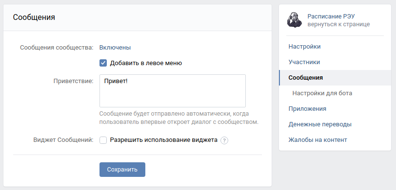

# Бот службы поддержки
Программа для автоматического ответа на вопросы пользователей в службу поддержки с помощью умного телеграм-бота на основе DialogFlow. DialogFlow — это платформа от Google для создания чат-ботов и голосовых ассистентов с использованием обработки естественного языка (NLP). Она позволяет легко создавать интерактивные диалоги, распознавать намерения пользователя и отвечать на них.

Пример работы бота:


Бот, с которым можно пропробовать пообщаться: @jj_dvmnpublisher_bot.


## Окружение

### Требования
Для использования программы у вас должен быть создан проект и агент в [DialogFlow](https://dialogflow.cloud.google.com/#/getStarted).

Для использования бота в группе VK, необходимо в настройках группы получить VK API токен и разрешить боту отправлять сообщения:



Для запуска программы вам понадобится Python 3.10. Скачайте репозиторий и установите python пакеты из `requirements.txt`:
```bash
git clone https://github.com/AlexRikka/devman_publishingbot.git
cd devman_publishingbot
pip install -r requirements.txt
```

### Переменные окружения
Часть настроек проекта берётся из переменных окружения. Чтобы их определить, создайте файл `.env` в корне проекта и добавьте в него следующие переменные:
- TG_BOT_TOKEN: токен телеграм бота, с которым будут общаться пользователи
- GOOGLE_APPLICATION_CREDENTIALS: путь до файла с private key (credentials) от service account на Google Cloud Platform в формате json
- DIALOGFLOW_PROJECT_ID: id проекта в DialogFlow
- DIALOGFLOW_LANGUAGE_CODE: код языка бота, в нашем случае ru
- INTENTS_JSON: путь до json файла формата utf-8 с вопросами и ответами для создания Intent, пример - questions.json
- TG_LOG_BOT_TOKEN: токен телеграм бота-логгера, который сообщает о состоянии бота техподдержки
- TG_CHAT_ID: chat_id чата пользователя с ботом-логгером, можно узнать через телеграм-бот @userinfobot
- VK_TOKEN: токен VK API от группы в VK

### Запуск
Добавить Intent-ы в проект DialogFlow из файла INTENTS_JSON:
```
python create_intent.py
```

Запустите бота в телеграм:
```
python tgbot.py
```
Запустите бота в VK:
```
python vkbot.py
```

## Цель проекта
Код написан в образовательных целях на онлайн-курсе для веб-разработчиков dvmn.org.
